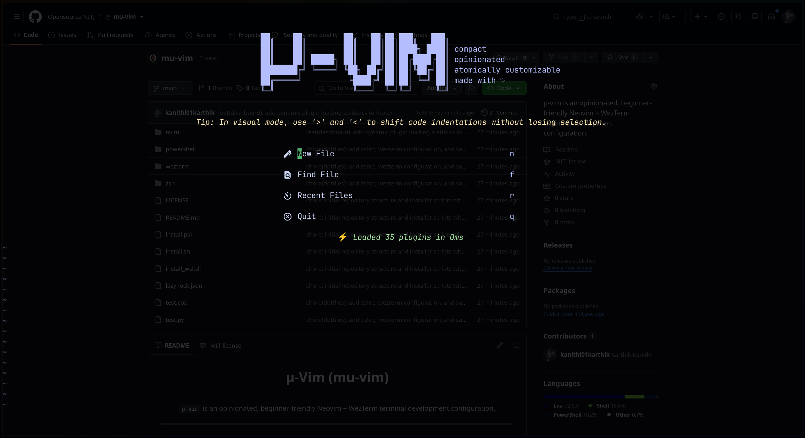

# <p align="center">μ-Vim (mu-vim)</p>

<p align="center">
  <code><b>μ-vim</b></code> is an opinionated, beginner-friendly Neovim + WezTerm terminal development configuration.
</p>

---

## 1. What is this?

**μ-vim** is a highly curated, premium configuration designed specifically for developers brand-new to terminal-based editing. It bridges the gap between modern IDEs (like VS Code) and the keyboard-driven power of Neovim, featuring a sidebar explorer, debugger, git indicators, and AI autocomplete. By packaging everything with WezTerm and a minimal shell configuration, you get a beautiful, unified workspace out of the box.

---

## 2. Windows Support & Compatibility Limitations

Windows users have two paths to run `mu-vim`. We strongly recommend the **WSL2** path for a seamless, developer-first Unix experience.

### Windows Compatibility Matrix

| Component          |      Linux       |           Windows Native           |        WSL2 (Recommended)        |
| :----------------- | :--------------: | :--------------------------------: | :------------------------------: |
| **zsh**            |     ✓ Native     |         ✗ (Not supported)          |        ✓ via Ubuntu layer        |
| **XDG paths**      | ✓ (`~/.config/`) |       ✗ (`%LOCALAPPDATA%\`)        |         ✓ (`~/.config/`)         |
| **Neovim**         |        ✓         |         ✓ with path quirks         |                ✓                 |
| **WezTerm**        |        ✓         |        ✓ Windows-side only         | ✓ Windows-side (connects to WSL) |
| **DAP (codelldb)** |        ✓         | ⚠ Needs host compiler (MSVC/MinGW) |                ✓                 |
| **Mason LSPs**     |        ✓         | ⚠ Some require manual Windows SDKs |                ✓                 |
| **Starship**       |        ✓         |            ✓ via scoop             |                ✓                 |
| **Copilot + Chat** |        ✓         |                 ✓                  |                ✓                 |
| **Install Script** |   `install.sh`   |           `install.ps1`            |         `install_wsl.sh`         |
| **Nerd Fonts**     |    ✓ via apt     |         ⚠ manual or scoop          |       Windows-side install       |

**Verdict:** **WSL2** is a first-class, fully supported environment. Native Windows is supported but debuggers and complex LSPs may require manual host compiler setups (MSVC or MinGW).

---

## 3. Prerequisites & Installation

### Prerequisites

| Operating System          | Recommended Terminal Host | Shell Requirement        | Connection          |
| :------------------------ | :------------------------ | :----------------------- | :------------------ |
| **Linux (Ubuntu/Debian)** | WezTerm (Wayland/X11)     | Zsh                      | Internet Connection |
| **macOS (Intel/Apple)**   | WezTerm (macOS Cask)      | Zsh                      | Internet Connection |
| **Windows WSL2**          | WezTerm (Windows side)    | Zsh (inside Ubuntu dist) | Internet Connection |
| **Windows Native**        | WezTerm (Windows side)    | PowerShell 7+ (`pwsh`)   | Internet Connection |

---

### One-Command Quick Installers

Select the command corresponding to your operating system and paste it into your terminal:

#### Linux (Debian/Ubuntu) & macOS

```bash
curl -fsSL https://raw.githubusercontent.com/Opensource-NITJ/mu-vim/main/install.sh | bash
```

#### Windows WSL2 (Ubuntu layer)

1. Run `wsl --install` in Windows PowerShell (if WSL is not yet active).
2. Install WezTerm on the **Windows host** (e.g. `winget install wez.wezterm`).
3. Run the following command inside your WSL Ubuntu shell terminal:

```bash
curl -fsSL https://raw.githubusercontent.com/Opensource-NITJ/mu-vim/main/install_wsl.sh | bash
```

#### Windows Native (PowerShell 7+ Only)

1. Install PowerShell 7+ (`pwsh.exe`) if running PowerShell 5.1.
2. Open PowerShell 7 and run:

```powershell
irm https://raw.githubusercontent.com/Opensource-NITJ/mu-vim/main/install.ps1 | iex
```

---

### Post-Install Checklist

1. **Set Zsh as default shell** (Mac/Linux): Run `chsh -s $(which zsh)`.
2. **Start Neovim**: Run `nvim` in your shell. The `lazy.nvim` manager will automatically download and install all locked plugins.
3. **Verify LSPs**: Once in Neovim, type `:Mason` to see the status of `lua_ls`, `pyright`, `clangd`, and `bashls`.
4. **Learn basic motions**: Run `vimtutor` in your terminal to practice.
5. **Aesthetic check**: Make sure WezTerm is configured with the `JetBrains Mono` font so icons show correctly.

---

## 4. Keymap Cheatsheet

Below is the curated keymap menu configured in [keymaps.lua](file:///home/karthik-kanithi/.gemini/antigravity-cli/scratch/mu-vim/nvim/lua/core/keymaps.lua) and individual plugin files.

### General & Navigation

- `Space` is the **Leader Key** (written as `<leader>` in commands).
- `Ctrl + h/j/k/l` - Navigate between split windows (left, down, up, right).
- `Shift + h` / `Shift + l` - Cycle buffers (prev/next file).
- `<leader>bd` - Close current buffer.
- `Ctrl + n` or `<leader>e` - Toggle the Neo-tree sidebar explorer.
- `Alt + j` / `Alt + k` (Visual Mode) - Move selected block down/up.
- `>` / `<` (Visual Mode) - Shift indentation right/left (preserves selection).
- `Esc + Esc` (Terminal Mode) - Return to normal terminal window command mode.

### Telescope Fuzzy Finder

- `<leader>ff` - Find files in current workspace folder.
- `<leader>fr` - List recently opened files.
- `<leader>fg` - Search text strings globally in workspace (live grep).
- `<leader>fc` - Search text matching the word under your cursor.
- `<leader>fb` - List currently open files/buffers.
- `<leader>fh` - Search Neovim documentation help tags.
- `<leader>fk` - Search registered keyboard shortcuts.

### LSP (Code Intelligence)

- `gd` - Go to Definition of the code symbol under cursor.
- `gD` - Go to Declaration.
- `gi` - Go to Implementation.
- `gr` - Find all references using Telescope.
- `K` - Open documentation hover popup.
- `<leader>cr` - Rename code symbol across workspace files.
- `<leader>ca` - Open LSP code actions/quick fixes.
- `<leader>cd` - Open floating window detailing line syntax diagnostics.
- `[d` / `]d` - Go to previous/next syntax diagnostic.

### DAP (Visual Debugger)

- `<leader>db` - Toggle breakpoint on current line.
- `<leader>dB` - Set a conditional breakpoint.
- `<leader>dc` - Continue execution / start debugging.
- `<leader>di` - Step Into.
- `<leader>do` - Step Over.
- `<leader>dO` - Step Out.
- `<leader>dt` - Terminate debugging session.
- `<leader>du` - Toggle DAP UI panel layout.
- `<leader>de` - Evaluate variable under cursor.

### GitHub Copilot & Chat

- `<leader>cp` - Enable/Disable GitHub Copilot suggestions toggle (sends state notifications).
- `<leader>cc` (Normal mode) - Toggle Copilot Chat panel.
- `<leader>cc` (Visual mode) - Toggle Copilot Chat using selection as prompt context.

### Git (Gitsigns gutter)

- `]c` / `[c` - Jump to next/previous change hunk.
- `<leader>gp` - Preview change details in popup window.
- `<leader>gb` - Toggle inline git blame line.
- `<leader>gd` - Open split comparison showing changes against git index.
- `<leader>gs` / `<leader>gr` - Stage/Reset change hunk.

### Code Runner (Dual Runner)

- `<leader>rr` - Save and run the current file (supports C, C++, and Python).
- `<leader>rt` - Toggle Code Runner mode:
  - **Buffer mode** (Default): Opens split scratch buffers inside Neovim for streaming stdout. Paste input in the left split, then press `Enter` in normal mode to execute.
  - **Terminal mode**: Launches an interactive, native WezTerm split pane below your editor (great for keyboard inputs).

---

## 5. Copilot Setup & Authentication

GitHub Copilot is included but **disabled by default** to keep your editor clean and privacy-focused on initial setup.

1. **Authenticate**: Launch Neovim and run the setup command:
   ```vim
   :Copilot auth
   ```
2. **Authorize**: Copy the authorization code shown in Neovim and log in to your GitHub account via your web browser.
3. **Turn On**: Press `<leader>cp` in normal mode. You will receive an editor notification stating `GitHub Copilot Enabled`.
4. **Permanent Opt-In**: To enable Copilot permanently on startup, open [copilot.lua](file:///home/karthik-kanithi/.gemini/antigravity-cli/scratch/mu-vim/nvim/lua/plugins/copilot.lua) and comment out `vim.cmd("Copilot disable")`.

---

## 6. Curated Beginner Resources

These resources are selected to help you master modal editing and configuring Neovim:

- **`vimtutor`**: Open your terminal, type `vimtutor`, and press Enter. It is the best 30-minute interactive typing course to learn Vim commands.
- **[Learn-Vim Guide](https://github.com/iggredible/Learn-Vim)**: An excellent, highly graphical markdown guide detailing visual layouts of motions and operations.
- **[TJ DeVries' YouTube Channel](https://www.youtube.com/@teej_dv)**: Videos by a core Neovim developer explaining the editor, configuration styles, and plugin options.
- **[Typecraft's Neovim for Beginners](https://www.youtube.com/playlist?list=PLsz00TDipIffreIaUNk64KxTIkQa382FT)**: The cleanest, step-by-step video series teaching you Lua-based configurations and hotkeys.
- **[Vim Adventures](https://vim-adventures.com)**: A fun, gamified online web game where you navigate using standard Vim keys (`h`, `j`, `k`, `l`, etc.).
- **[Neovim Documentation](https://neovim.io/doc/)**: The official manuals. You can also access these directly inside the editor using the command `:help`.

---

## 7. Screenshot / Demo

Add a screenshot or video demonstration of `mu-vim` here to show off the visual aesthetics (Catppuccin Mocha theme, status lines, tree sidebar, and Alpha dashboard!).


_Caption: The μ-Vim dashboard greeting you on launch, showcasing the Lavender μ ASCII logo, utility shortcuts, and rotating developer tips._

---

## 8. Customizing μ-Vim

Once you get comfortable with the default layout, you can easily customize and extend it:

### Changing Editor Options

To edit default settings (like tab widths, line numbering, or mouse settings), open [options.lua](file:///home/karthik-kanithi/.gemini/antigravity-cli/scratch/mu-vim/nvim/lua/core/options.lua). For example, to enable line wrapping:

```lua
vim.opt.wrap = true
```

### Adding Custom Keymaps

Open [keymaps.lua](file:///home/karthik-kanithi/.gemini/antigravity-cli/scratch/mu-vim/nvim/lua/core/keymaps.lua) and add your bindings using Neovim's mapping helper. Make sure to specify a `desc` parameter so it registers with the Which-Key popup:

```lua
vim.keymap.set("n", "<leader>my", ":echo 'Hello!'<CR>", { desc = "Custom greeting shortcut" })
```

### Installing New Plugins

To add a new plugin, create a new `.lua` file inside [plugins/](file:///home/karthik-kanithi/.gemini/antigravity-cli/scratch/mu-vim/nvim/lua/plugins/) (e.g. `plugins/markdown.lua`). Use the standard `lazy.nvim` syntax:

```lua
return {
  {
    "tpope/vim-surround", -- The plugin GitHub repository
    -- You can specify options, hooks, or events here!
  }
}
```

After saving, restart Neovim and `lazy.nvim` will automatically download and activate the new plugin.

### Shell Customization

You can customize command-line tools by appending aliases and local environment variables directly to your system's shell configuration files:

- **Linux/macOS**: Edit your user configuration at [~/.zshrc](file:///home/karthik-kanithi/.gemini/antigravity-cli/scratch/mu-vim/zsh/.zshrc)
- **Windows Native**: Edit your profile at [profile.ps1](file:///home/karthik-kanithi/.gemini/antigravity-cli/scratch/mu-vim/powershell/profile.ps1)

### 💡 The Ultimate Hack (AI-Powered Customization)

Tired of manually writing Lua boilerplate, configuring tables, or debugging plugin hooks? Simply open the config folder in an AI-powered IDE of your choice, activate its agentic coding tool, and tell it: _"Add a markdown previewer, configure format-on-save, and write it in the mu-vim file structure."_ Let the machine do the heavy lifting!

---

## 9. Contributing & License

Contributions to simplify, optimize, or document configurations are welcome! Please ensure keymaps include descriptive annotations.

This project is released under the **MIT License**.
